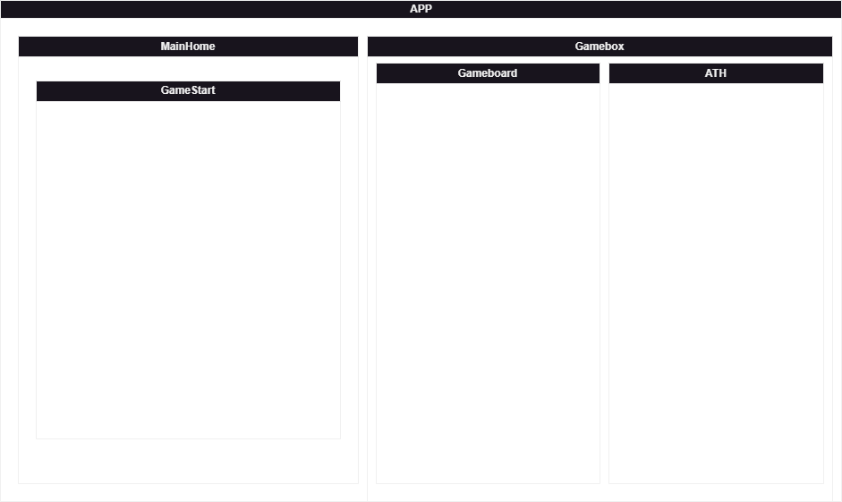
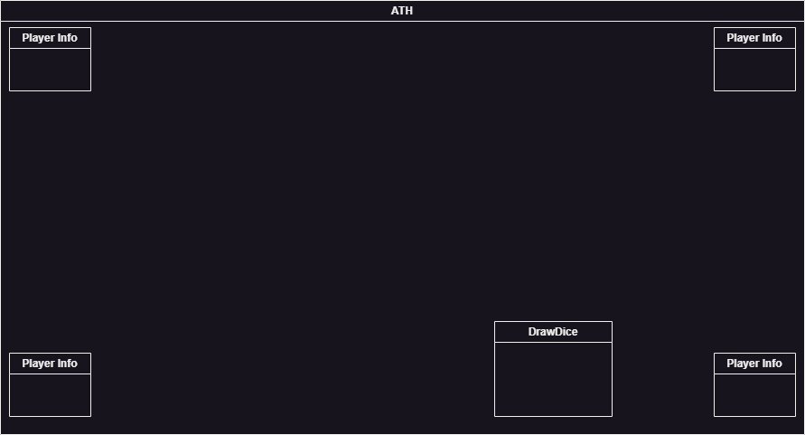
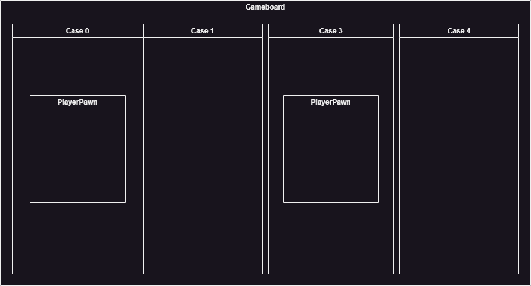
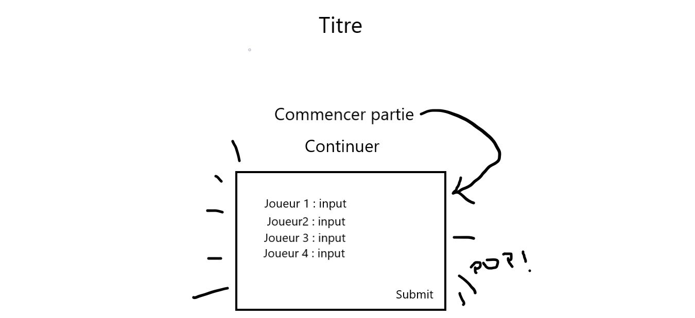
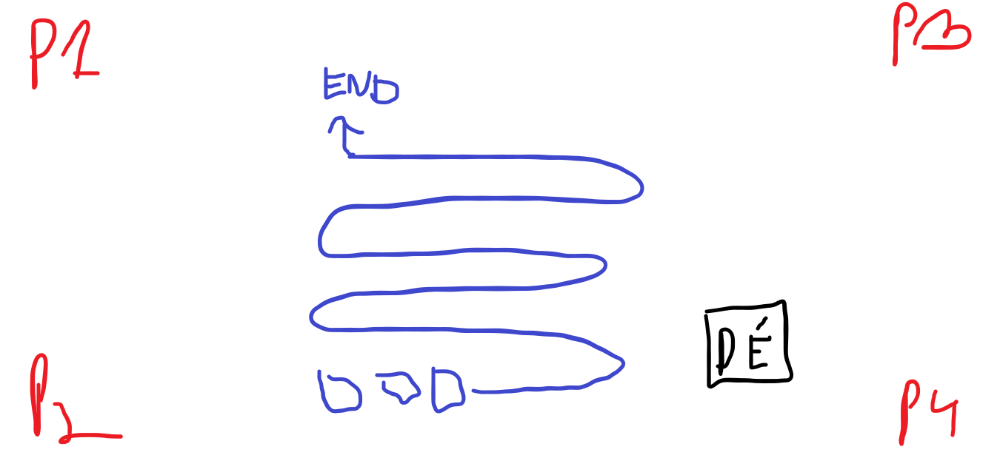

# VueJS: Projet de l'Oie

## I. Écrans & Architecture des Vues

### 1. Menu Principal (`landing/MainMenu.vue`)

- Nouvelle Partie
  - Customisation de la partie (Modal dédiée):
    - Gestion des Joueurs (Nom, choix de la couleur). <!-- choix image, choix nombre -->
    - Taille du Plateau
- Continuer Partie Existante (Optionnel: grisé si aucun localStorage trouvé).

### 2. Plateau de Jeu (`gameboard/GameBoard.vue`)

- ATH: Disposé en superposition aux 4 coins de l'écran.
- Zone centrale: Contient le `GameBoard` (Plateau) et la `Gamebox` (Zone d'action/Dés).

## II. Composants & Architecture Vue

### 1. Structure Globale (`Components/`)

- `GameBox.vue`: Zone centrale interactive. Contient le composant `Dice.vue` (gestion de l'animation du lancer) et les messages d'état.
- `Modal.vue`: Composant générique et réutilisable (Props: `isOpen`, `title`). Utilise des *Slots* pour le `Header`, `Body`, et `Footer` (Boutons d'actions).
- `Hud.vue`: Cartes joueurs affichées en coins.
  - *Props*: `PlayerData: Object`, `isActive: Boolean`.
  - *Contenu*: Nom, Avatar, Score/Case actuelle, et un indicateur visuel si c'est son tour.
- `GameBoard.vue`: Contient le chemain des cases. Génère dynamiquement le plateau via un `v-for`.
- `BoardSquare.vue`: Représente une case unique.
  - *Props*: `cellData: CellClass`.
  - *Contenu*: Numéro de la case, design selon le type (Neutre, Action, Malus), et conteneur pour les pions.
- `Pawn.vue`: Le pion du joueur (pastille colorée). Animé avec des transitions CSS lors des déplacements.

### 2. Logique des Cases (Modèle de données)

```js
export class Cell {
  constructor(id, type = 'neutral', effect = null, label = '') {
    this.id = id; // Numéro de la case (0 à 63)
    this.type = type; // 'neutral', 'bonus', 'malus', 'teleport'
    this.effect = effect; // Fonction
    this.label = label; // Nom de la case (ex: "Labyrinthe")
    this.player = player; // Joueur présent sur la case
  }
}
```

#### Catalogue des effets à implémenter

| Case | Type | Nom | Effet |
| --- | --- | --- | --- |
| Multiples de 9 | Bonus | Oie | Double la valeur du dé lancé. |
| Case 6 | Téléport | Pont | Déplace immédiatement le joueur à la case 12. |
| Case 19 | Malus | Hôtel | Passe le tour du joueur étant tombé dessus. |
| Case 42 | Malus | Labyrinthe | Recul forcé de 12 cases (renvoie à la case 30). |
| Case 51 | Malus | Puits | Doit attendre 2 tours avant de pouvoir rejouer. |
| Case 58 | Malus | Tête de Mort | Renvoie immédiatement à la case 0. |

<!-- ## III. Gestion de l'État Global (State Management) -->

## IV. Répartition des Tâches & Suivi

### :hammer_and_wrench: Florian (UI & Structure Globale)

- [X] Création du `MainMenu.vue` et de la logique de configuration des joueurs.
- [X] Développement du composant générique `Modal.vue` (avec slots).
- [X] Intégration et design de l'ATH (`Hud.vue`) aux quatres coins du plateau.
- [X] Développement de la `GameBox.vue` et du système de lancer de Dé (`Dice.vue` avec génération de nombre aléatoire 1-6).

### :test_tube: Thomas (Logique du Plateau & Rendu)

- [X] __Étape 1__: Création de la classe `Cell` et script de génération du tableau des 64 cases (avec types et effets).
- [X] __Étape 2__: Création du composant visuel `BoardSquare.vue` (CSS pour différencier les oies, ponts, labyrinthe, etc.).
- [X] __Étape 3__: Assemblage du `GameBoard.vue` (disposition des cases en zig-zag).

### :game_die: Nicolas (Gameplay & Entités)

- [X] Modélisation des joueurs et création du composant `Pawn.vue` (Pion).
- [X] Gestion de la logique d'affichage des pions à *l'intérieur* d'une même case (gérer les chevauchements si deux joueurs sont sur la même case).

## IV. Schémas





## V. Prototypes

### 1. Menu Principal



### 2. Jeu



*[ATH]: Affichage Tête Haute
